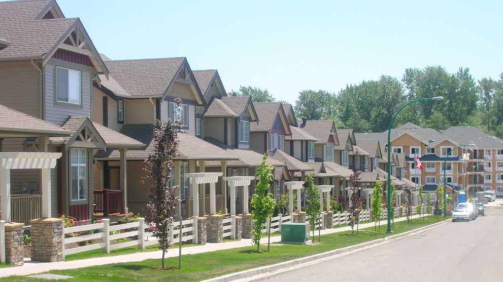

# Predicting Personal Housing Affordability

# Programming Language

Python and R

# Project Description

This project aims to explore housing costs in America. Additionally, this project aims to build a model to predict what a user's lower and upper affordable spending limits are when buying a house.

# Usage

This project is meant to explore housing costs in America.

# Contributors

This project was designed and implemented by Josh Gardner.

# Project Status

This project is completed.

# [Return Home](https://yasa-mufasa.github.io/Josh-Gardner.github.io/)
